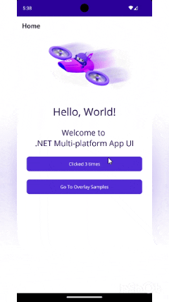

## Matrixlukan.Maui.Controls.OverlayView

A .NET MAUI control library providing an easy-to-use, customizable overlay view for Android and iOS applications. This package is designed to help developers display floating UI elements, dialogs, or custom overlays on top of existing content in MAUI projects.

## Features

- **Cross-platform support:** Works on Android and iOS (.NET 8).
- **Customizable overlays:** Easily create overlays with custom content and appearance.
- **Integration with MAUI:** Seamless usage with MAUI pages and controls.
- **Single project structure:** Simplifies multi-platform development.

## Getting Started

### Installation

Add a reference to the `Matrixlukan.Maui.Controls.OverlayView` project in your MAUI solution.

Or, if published as a NuGet package:

### Usage Example

1. **Create your custom floating view by inheriting `OverlayBaseView`:**
    ``` csharp
    public partial class CustomSnackbar : OverlayBaseView
    {
        public CustomSnackbar()
        {
            InitializeComponent();
        }
    }
    ```
2. **Use `Overlay.Shared` to instantiate your floating view and display it:**
``` csharp
Overlay.Shared.Open(
    new CustomSnackbar(),
    Anchor.Bottom,
    new LayoutBounds(0.5, 1),
    LayoutFlags.PositionProportional
);
```
3. **Close the floating view by invoking `Close()`:**
``` csharp
Overlay.Shared.Close();
```
### Sample

See the `Matrixlukan.Maui.Controls.Sample` project for usage examples, including custom overlays and floating buttons.



## Supported Platforms

- Android (API 21+)
- iOS (iOS 15+)

## Requirements

- .NET 8
- .NET MAUI

## Contributing

Contributions are welcome! Please submit issues or pull requests via GitHub.

## License

This project is licensed under the MIT License.
